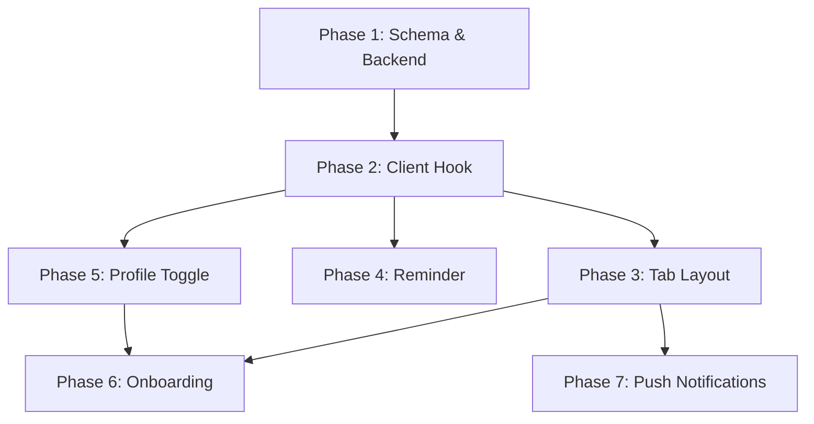

# Implementation Plan: Dual Mode — 🌾 Farmer / 🌿 Gardener

> Tài liệu hướng dẫn triển khai từng phase cho tính năng 2 mode trong Richfarm.
> Tham khảo: [UI_SIMPLIFICATION_RESEARCH.md](./UI_SIMPLIFICATION_RESEARCH.md)

---

## Tổng quan

App sẽ có 2 mode chính:
- 🌿 **Gardener** — hobby, ban công, indoor, người mới. UI đơn giản, flat plant list, reminders cơ bản.
- 🌾 **Farmer** — farm, food production, off-grid. Full features: Garden → Bed → Plant, Planning, Growing, Harvest.

User chọn mode trong onboarding, chuyển đổi bất kỳ lúc nào trong Profile. **Mode chỉ thay đổi UI, không thay đổi dữ liệu.**

---

## Phase 1: Schema & Backend (Nền tảng)

> **Mục tiêu**: Thêm `appMode` vào database, đảm bảo mutation & query hỗ trợ mode.

### 1.1. Thêm `appMode` vào schema

**File**: `convex/schema.ts` (dòng 479–509, bảng `userSettings`)

```diff
 userSettings: defineTable({
     userId: v.id("users"),
+    appMode: v.optional(v.string()), // "farmer" | "gardener"
     theme: v.optional(v.string()),
     ...
 })
```

> [!NOTE]
> Dùng `v.optional(v.string())` thay vì `v.union()` để backward-compatible với user cũ chưa có field này.

**Giá trị mặc định**: `undefined` → app treat như `"farmer"` (behavior hiện tại).

### 1.2. Cập nhật mutation `upsertUserSettings`

**File**: `convex/userSettings.ts`

Thêm `appMode` vào args và handler:

```diff
 export const upsertUserSettings = mutation({
     args: {
         deviceId: v.optional(v.string()),
+        appMode: v.optional(v.string()),
         unitSystem: v.optional(v.string()),
         theme: v.optional(v.string()),
         onboarding: v.optional(v.object({...})),
     },
     handler: async (ctx, args) => {
         ...
         if (existing) {
             await ctx.db.patch(existing._id, {
+                ...(args.appMode !== undefined && { appMode: args.appMode }),
                 ...(args.unitSystem !== undefined && { unitSystem: args.unitSystem }),
                 ...
             });
         }
         ...
     },
 });
```

### 1.3. Derive `appMode` từ onboarding (cho user cũ)

**File**: `convex/userSettings.ts` hoặc helper mới

Logic auto-derive khi `appMode` chưa được set:

```typescript
function deriveAppMode(onboarding: OnboardingData | undefined): "farmer" | "gardener" {
    if (!onboarding) return "farmer"; // default cho user cũ

    const farmGoals = ["food_production", "business", "off_grid", "homestead"];
    const hasFarmGoal = onboarding.goals.some(g => farmGoals.includes(g));
    const isExperienced = onboarding.experience !== "new_to_farming";
    const isLargeScale = onboarding.scaleEnvironment.some(s =>
        ["farm_mini", "farm_large", "greenhouse"].includes(s)
    );

    if (hasFarmGoal || isLargeScale || isExperienced) return "farmer";
    return "gardener";
}
```

### 1.4. Thêm query helper `getAppMode`

**File**: `convex/userSettings.ts`

```typescript
export const getAppMode = query({
    args: { deviceId: v.optional(v.string()) },
    handler: async (ctx, args) => {
        const user = await getUserByIdentityOrDevice(ctx, args.deviceId);
        if (!user) return "farmer";
        const settings = await ctx.db
            .query("userSettings")
            .withIndex("by_user", q => q.eq("userId", user._id))
            .unique();
        if (settings?.appMode) return settings.appMode;
        return deriveAppMode(settings?.onboarding);
    },
});
```

### ⚠️ Lưu ý Database — Phase 1

| Vấn đề | Chi tiết | Giải pháp |
|---------|----------|-----------|
| User cũ không có `appMode` | Field mới, chưa ai có giá trị | `v.optional` + derive logic fallback |
| Migration không cần thiết | Convex schema là additive, optional field không breaking | Không cần migration script |
| Consistency | `appMode` chỉ là UI preference, không ảnh hưởng data integrity | Không cần transaction hoặc version check |
| Validation | Chỉ accept `"farmer"` hoặc `"gardener"` | Server-side validation trong mutation |

---

## Phase 2: Client Hook & Context

> **Mục tiêu**: Tạo React context + hook để toàn app biết mode hiện tại.

### 2.1. Cập nhật `useUserSettings` hook

**File**: `hooks/useUserSettings.ts`

Thêm `appMode` vào `updateSettings`:

```diff
 const updateSettings = async (args: {
     unitSystem?: string;
     theme?: string;
+    appMode?: string;
 }) => {
     return await upsert({ ...args, deviceId });
 };

 return {
     settings,
     updateSettings,
+    appMode: settings?.appMode ?? deriveAppMode(settings?.onboarding) ?? "farmer",
     isLoading,
 };
```

### 2.2. Tạo `useAppMode` hook (convenience)

**File**: `hooks/useAppMode.ts` [NEW]

```typescript
export function useAppMode() {
    const { settings, updateSettings, isLoading } = useUserSettings();

    const appMode: "farmer" | "gardener" =
        (settings?.appMode as any) ?? "farmer";
    const isFarmer = appMode === "farmer";
    const isGardener = appMode === "gardener";

    const switchMode = async (mode: "farmer" | "gardener") => {
        await updateSettings({ appMode: mode });
    };

    return { appMode, isFarmer, isGardener, switchMode, isLoading };
}
```

### ⚠️ Lưu ý — Phase 2

| Vấn đề | Chi tiết | Giải pháp |
|---------|----------|-----------|
| Race condition khi switch | User switch mode → UI flicker | Optimistic update: set local state trước, rồi sync |
| SSR / undefined trước khi load | Hook trả undefined khi query chưa resolve | Default `"farmer"` cho đến khi resolved |
| Caching | `useQueryCache` đã wrap `getUserSettings` | `appMode` tự động cached cùng settings |

---

## Phase 3: Tab Layout Conditional

> **Mục tiêu**: Ẩn/hiện tabs và routes dựa trên mode.

### 3.1. Cập nhật `_layout.tsx`

**File**: `app/(tabs)/_layout.tsx`

```typescript
export default function TabLayout() {
    const { appMode, isLoading } = useAppMode();
    const isGardener = appMode === "gardener";
    ...

    return (
        <Tabs ...>
            {/* Luôn hiện */}
            <Tabs.Screen name="home" ... />
            <Tabs.Screen name="garden/index" options={{
                title: isGardener ? t('tabs.my_plants') : t('tabs.garden'),
                ...
            }} />
            <Tabs.Screen name="library" ... />
            <Tabs.Screen name="reminder" ... />
            <Tabs.Screen name="profile" ... />

            {/* Luôn ẩn + thêm ẩn khi Gardener */}
            <Tabs.Screen name="planning" options={{ href: null }} />
            <Tabs.Screen name="growing" options={{ href: null }} />
            <Tabs.Screen name="explorer" options={{ href: null }} />
        </Tabs>
    );
}
```

### 3.2. Garden screen → dual behavior

**File**: `app/(tabs)/garden/index.tsx` (1247 dòng — file lớn nhất)

Hiện tại, file này chứa `SlidingTabBar` với 3 tabs: **Garden | Planning | Growing**.

**Gardener mode**:
- Ẩn `SlidingTabBar` hoàn toàn
- Thay `GardenTabContent` bằng **flat list tất cả `userPlants`**
- Giữ nút **+ Add Plant** (mở bottom sheet add plant đơn giản)
- Ẩn bed selection trong add plant flow

**Farmer mode**:
- Giữ nguyên behavior hiện tại (không thay đổi gì)

```typescript
// Trong GardenScreen chính:
const { isGardener, isFarmer } = useAppMode();

if (isGardener) {
    return <GardenerMyPlantsView />;
}
// else: render existing Garden/Planning/Growing tabs
```

### 3.3. Tạo `GardenerMyPlantsView` component

**File**: `app/(tabs)/garden/GardenerMyPlantsView.tsx` [NEW]

Component đơn giản:
- Flat list tất cả `userPlants` (query by userId, **ignore bedId**)
- Group theo status: 🌱 Planning → 🌿 Growing → 📦 Archived
- Nút **+ Thêm cây** → mở bottom sheet (library search + AI scan)
- Tap plant → navigate to `/(tabs)/plant/[userPlantId]`

### ⚠️ Lưu ý — Phase 3

| Vấn đề | Chi tiết | Giải pháp |
|---------|----------|-----------|
| Garden screen quá lớn (1247 dòng) | Khó maintain nếu thêm conditional | Extract `GardenerMyPlantsView` thành file riêng |
| `SlidingTabBar` state khi switch mode | Tab state lưu ở `useState` | Reset khi mode thay đổi (`useEffect` trên `appMode`) |
| Route `/garden/[gardenId]` | Gardener có thể deep-link vào garden detail | Redirect về My Plants nếu Gardener mode |
| Bed routes | `/(tabs)/bed/[bedId]` | Redirect hoặc ẩn khi Gardener |

---

## Phase 4: Simplified Reminder

> **Mục tiêu**: Đơn giản hóa Reminder form cho Gardener.

### 4.1. Cập nhật `ReminderFormModal`

**File**: `app/(tabs)/reminder.tsx` (dòng 181–532)

**Gardener mode**:
- Ẩn bed selector (chỉ cho chọn plant)
- Ẩn RRULE configurator → thay bằng preset: "Hàng ngày", "2 ngày", "Hàng tuần"
- Ẩn priority selector
- Ẩn notification method picker
- Giữ: type, title, plant, date/time, water amount

**Farmer mode**: Giữ nguyên.

### 4.2. Reminder cards — ẩn bed label

**File**: `app/(tabs)/reminder.tsx` — `ReminderCard` component (dòng 89–179)

```typescript
// Khi Gardener mode:
// Thay "Bed 2 · Watering" → "Basil, Cà chua · Watering"
if (isGardener && reminder.bedId) {
    // Query plants in bed, hiển thị tên cây thay vì tên bed
    const plantsInBed = plants.filter(p => p.bedId === reminder.bedId);
    displayLabel = plantsInBed.map(p => p.displayName).join(", ");
}
```

### ⚠️ Lưu ý — Phase 4

| Vấn đề | Chi tiết | Giải pháp |
|---------|----------|-----------|
| Reminder tạo ở Farmer (có bedId), xem ở Gardener | Label bed không có ý nghĩa | Resolve bed → plant names |
| Nhiều cây trong 1 bed | Label quá dài | Truncate: "Basil, Cà chua +3" |
| Tạo reminder ở Gardener → không có bedId | Chuyển về Farmer, reminder thiếu context | OK — reminder plant-level vẫn valid ở Farmer |

---

## Phase 5: Profile — Mode Toggle

> **Mục tiêu**: Cho phép user chuyển mode trong Profile.

### 5.1. Thêm toggle vào Profile screen

**File**: `app/(tabs)/profile.tsx`

Thêm section mới sau "Appearance" / "Theme":

```
┌─────────────────────────────────────┐
│  App Mode                           │
│                                     │
│  🌿 Gardener    ←→    🌾 Farmer    │
│  [●━━━━━━━━━━━━━━━━━━━━━━━━━━○]    │
│                                     │
│  Gardener: Giao diện đơn giản,     │
│  phù hợp trồng cây hobby.          │
└─────────────────────────────────────┘
```

### 5.2. Confirmation dialog khi chuyển mode

Hiển thị dialog xác nhận (đặc biệt Farmer → Gardener):
- "Dữ liệu Gardens & Beds được giữ nguyên, chỉ ẩn khỏi UI."
- "Bạn có thể chuyển lại bất kỳ lúc nào."

### ⚠️ Lưu ý — Phase 5

| Vấn đề | Chi tiết | Giải pháp |
|---------|----------|-----------|
| User switch liên tục | Spam toggle → nhiều mutations | Debounce 500ms trước gọi mutation |
| Analytics | Cần track switch events | Log `mode_switch` event với from/to |

---

## Phase 6: Onboarding Auto-Detect

> **Mục tiêu**: Auto-set `appMode` khi user hoàn thành onboarding.

### 6.1. Cập nhật onboarding completion handler

**Files**: Onboarding screen(s) + `convex/userSettings.ts`

Khi user hoàn thành bước 5:
1. Gọi `upsertUserSettings` với onboarding data
2. Derive `appMode` từ answers
3. Set cả `onboarding` + `appMode` trong cùng 1 mutation call

```typescript
const appMode = deriveAppMode(onboardingData);
await updateSettings({
    onboarding: onboardingData,
    appMode,
});
```

### 6.2. First-time prompt cho users cũ

Nếu user cũ chưa có `appMode` và chưa có `onboarding`:
- Hiện 1 prompt đơn giản: "Bạn đang trồng cây theo kiểu nào?"
- 2 option: 🌿 Gardener (đơn giản) / 🌾 Farmer (đầy đủ)
- Set `appMode` và dismiss

---

## Phase 7: Push Notifications

> **Mục tiêu**: Format push message theo mode tại thời điểm gửi.

### 7.1. Cập nhật notification formatter

**File**: `convex/notifications.ts`

Khi gửi push notification cho reminder:
1. Query `userSettings.appMode` tại thời điểm gửi
2. Format message:
   - **Farmer**: "Tưới Bed 2 — 3 cây"
   - **Gardener**: "Tưới Basil, Cà chua"

```typescript
async function formatReminderNotification(reminder, userSettings) {
    const mode = userSettings?.appMode ?? "farmer";

    if (mode === "gardener" && reminder.bedId) {
        const plants = await ctx.db
            .query("userPlants")
            .withIndex("by_bed", q => q.eq("bedId", reminder.bedId))
            .collect();
        const names = plants.map(p => p.displayName).slice(0, 3);
        return `${reminder.title}: ${names.join(", ")}`;
    }
    return `${reminder.title} — ${reminder.bedName ?? ""}`;
}
```

---

## Edge Cases & Database Concerns — Tổng hợp

### Data Integrity

| Concern | Phân tích | Kết luận |
|---------|-----------|----------|
| **`bedId` nullable** | `userPlants.bedId` đã là `v.optional` trong schema | ✅ An toàn — cây không cần bed |
| **Orphaned plants** | Cây tạo ở Gardener mode (no bed) → chuyển Farmer | Hiện section "Unassigned" — cần UI trong Farmer |
| **Orphaned reminders** | Reminder gắn bed, bed bị xóa | Cần null check khi render — đã xử lý |
| **Multi-garden merge** | Gardener flat list trộn cây từ nhiều gardens | Query by userId, thêm subtle garden badge |
| **Concurrent edits** | 2 thiết bị — 1 Farmer, 1 Gardener | `appMode` sync qua Convex real-time — last write wins |

### Query Patterns

| Mode | Query plants | Query reminders |
|------|-------------|-----------------|
| **Farmer** | `by_user_status` → group by garden/bed | `by_user_next_run` → group by bed |
| **Gardener** | `by_user` → flat list, sort by status | `by_user_next_run` → flat list, hide bed context |

> [!IMPORTANT]
> **Không tạo query mới** cho Gardener mode — reuse query hiện tại (`by_user`) rồi client-side filter/sort. Tránh duplicate logic và indexes không cần thiết.

### Performance

| Concern | Chi tiết | Giải pháp |
|---------|----------|-----------|
| **Extra query cho `appMode`** | Mỗi component cần biết mode | `useAppMode()` hook đọc từ `useUserSettings()` — đã cached, chỉ 1 subscription |
| **Gardener flat list nhiều cây** | 50+ plants → scroll kém | Pagination hoặc virtualized list (FlatList thay ScrollView) |
| **Bed → plant resolution cho reminder labels** | N+1 query risk | Pre-join plants khi query reminders, hoặc batch resolve |

---

## Localization

Cần thêm i18n keys mới:

| Key | EN | VI |
|-----|----|----|
| `tabs.my_plants` | My Plants | Cây của tôi |
| `profile.app_mode` | App Mode | Chế độ |
| `profile.mode_gardener` | 🌿 Gardener | 🌿 Người trồng cây |
| `profile.mode_farmer` | 🌾 Farmer | 🌾 Nông dân |
| `profile.mode_gardener_desc` | Simple UI for hobby growing | Giao diện đơn giản cho trồng cây hobby |
| `profile.mode_farmer_desc` | Full features for farm management | Đầy đủ tính năng quản lý farm |
| `profile.switch_mode_title` | Switch to {mode}? | Chuyển sang {mode}? |
| `profile.switch_mode_desc` | Your data will be kept safe. | Dữ liệu được giữ nguyên. |
| `garden.unassigned_plants` | Unassigned Plants | Cây chưa phân bổ |
| `reminder.preset_daily` | Daily | Hàng ngày |
| `reminder.preset_every_2_days` | Every 2 days | 2 ngày 1 lần |
| `reminder.preset_weekly` | Weekly | Hàng tuần |

---

## Thứ tự triển khai & Dependencies



| Phase | Effort | Phụ thuộc | Có thể song song? |
|-------|--------|-----------|:---:|
| 1. Schema & Backend | 2-3 giờ | — | — |
| 2. Client Hook | 1-2 giờ | Phase 1 | — |
| 3. Tab Layout + Garden | 4-6 giờ | Phase 2 | — |
| 4. Reminder | 3-4 giờ | Phase 2 | ✅ Song song Phase 3 |
| 5. Profile Toggle | 2-3 giờ | Phase 2 | ✅ Song song Phase 3,4 |
| 6. Onboarding | 2-3 giờ | Phase 3, 5 | — |
| 7. Push Notifications | 2-3 giờ | Phase 3 | ✅ Song song Phase 6 |
| **Tổng** | **~3-4 ngày** | | |

---

## Verification Plan

### Automated

Hiện tại codebase có backend tests tại `backend/tests/`. Sau khi implement:

1. **Convex function test**: Test `upsertUserSettings` với `appMode` — verify lưu và đọc đúng.
   - Chạy: `npx convex-test` (nếu configured) hoặc test thủ công qua Convex dashboard.

2. **E2E with Maestro** (`.maestro/`): Nếu có flow files, thêm test cho mode switch.

### Manual Verification

| # | Test case | Steps | Expected |
|---|-----------|-------|----------|
| 1 | Default mode cho user mới | Mở app lần đầu → không onboarding | App hiện Farmer mode (default) |
| 2 | Switch Farmer → Gardener | Profile → App Mode → chọn Gardener | Tab Garden đổi thành "My Plants", flat list |
| 3 | Switch Gardener → Farmer | Profile → App Mode → chọn Farmer | Tab My Plants đổi lại thành "Garden", hiện hierarchy |
| 4 | Cây tạo ở Gardener | Gardener mode → thêm cây → switch Farmer | Cây hiện ở "Unassigned Plants" |
| 5 | Reminder bed-level ở Gardener | Tạo reminder gắn bed (Farmer) → switch Gardener | Reminder hiện, label = tên cây thay vì bed |
| 6 | Data persistence | Switch mode nhiều lần | Không mất cây, garden, reminder nào |
| 7 | Onboarding auto-detect | Onboarding → chọn "Thử nghiệm" + "Indoor" + "New" | App tự set Gardener mode |

---

## Review Report — Cross-check với Codebase (2026-03-03, updated 2026-03-04)

### Implementation Status

| Phase | Status | Files changed |
|-------|--------|---------------|
| 1. Schema & Backend | ✅ Done | `convex/schema.ts` (+appMode), `convex/userSettings.ts` (+appMode arg + derive), `convex/lib/appMode.ts` [NEW] |
| 2. Client Hook | ✅ Done | `lib/appMode.ts` [NEW], `hooks/useAppMode.ts` [NEW], `hooks/useUserSettings.ts` (+appMode export) |
| 3. Tab Layout + Garden | ✅ Done | `app/(tabs)/_layout.tsx`, `app/(tabs)/garden/index.tsx`, `app/(tabs)/garden/GardenerMyPlantsView.tsx` [NEW] |
| 4. Reminder | ✅ Done | `app/(tabs)/reminder.tsx` (+Gardener preset templates, bed→plant label, hidden bed selector) |
| 5. Profile Toggle | ✅ Done | `app/(tabs)/profile.tsx` (+mode toggle with Alert confirmation) |
| 6. Onboarding Auto-Detect | ⬜ Partial | `deriveAppModeFromOnboarding` ready, nhưng onboarding UI chưa gọi nó khi complete |
| 7. Push Notifications | ✅ Done | `convex/notifications.ts` (dùng shared `resolveAppMode`, format theo mode) |

### Review Issues — Resolved vs Remaining

| # | Vấn đề gốc | Status | Ghi chú |
|---|-------------|--------|---------|
| 1 | Phase 7 đã implement sẵn | ✅ Resolved | Đã dùng shared `resolveAppMode()` từ `convex/lib/appMode.ts` |
| 2 | `userPlants` không có `displayName` | ⚠️ Workaround | `GardenerMyPlantsView` dùng `plant.displayName ?? plant.scientificName` — OK vì `usePlants()` hook đã join data. Notifications dùng plant count thay vì names |
| 3 | Derive logic key mismatch | ✅ Resolved | Thống nhất keys: `["food", "business", "offgrid"]` cho goals, `["mini_farm", "large_farm", "greenhouse"]` cho scale — cả `convex/lib/appMode.ts` và `lib/appMode.ts` đều dùng cùng keys |
| 4 | `getAppMode` query redundant | ✅ Resolved | Đã bỏ — dùng `useUserSettings()` → derive ở client |
| 5 | Hidden routes → SlidingTabBar | ✅ Resolved | `garden/index.tsx` return `<GardenerMyPlantsView />` sớm khi Gardener, ẩn hoàn toàn SlidingTabBar |
| 6 | `deriveAppMode` shared utility | ✅ Resolved | Server: `convex/lib/appMode.ts` — Client: `lib/appMode.ts` (2 file riêng do Convex bundling) |
| 7 | Estimate time | ✅ N/A | Phần lớn đã implement |

### Kiến trúc hiện tại

```
Server (Convex):
  convex/lib/appMode.ts       ← requireAppMode, deriveAppModeFromOnboarding, resolveAppMode
  convex/userSettings.ts      ← upsert với appMode validation + auto-derive
  convex/notifications.ts     ← import resolveAppMode(), format push per mode

Client (React Native):
  lib/appMode.ts              ← normalizeAppMode, deriveAppModeFromOnboarding (client copy)
  hooks/useUserSettings.ts    ← appMode derived field
  hooks/useAppMode.ts         ← isFarmer, isGardener, switchMode (memoized)
```

### Items còn lại

- [ ] **Onboarding completion**: Khi user xong step 5, gọi `upsertUserSettings({ appMode: derivedMode })` — logic derive đã sẵn sàng, chỉ cần wire vào onboarding screen
- [ ] **First-time prompt cho user cũ**: Nếu `appMode` === undefined và không có onboarding data → hiện prompt chọn mode
- [ ] **"Unassigned Plants" section** trong Farmer mode: cây tạo ở Gardener (no bedId) chưa có section riêng khi switch về Farmer
- [ ] **Tab title dynamic**: `_layout.tsx` chưa đổi title "Garden" → "My Plants" khi Gardener (chỉ garden screen content đổi, tab label chưa)

> [!TIP]
> **Kết luận**: ~90% implementation đã hoàn thành. 4 items còn lại đều nhỏ (~1-2h tổng). Kiến trúc shared utility clean, không có duplicate logic. Review finding #2 (`displayName`) được xử lý thông minh — `usePlants()` hook đã join sẵn nên client-side OK.

---

*Tài liệu tạo: 2026-03-03*
*Review: 2026-03-04 00:25*
*Tham khảo: [UI_SIMPLIFICATION_RESEARCH.md](./UI_SIMPLIFICATION_RESEARCH.md), `convex/schema.ts`, `convex/userSettings.ts`, `convex/lib/appMode.ts`, `convex/notifications.ts`, `lib/appMode.ts`, `hooks/useAppMode.ts`, `app/(tabs)/garden/index.tsx`, `app/(tabs)/garden/GardenerMyPlantsView.tsx`, `app/(tabs)/reminder.tsx`, `app/(tabs)/profile.tsx`, `app/(tabs)/plant/[userPlantId].tsx`*


