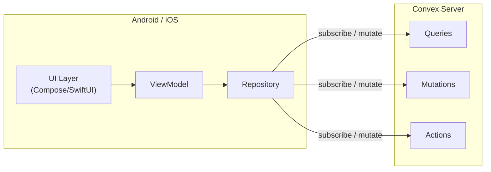

# Kế hoạch chuyển RichFarm sang Native (Kotlin + Swift)

## 1. Tổng quan

Viết lại app bằng **100% native** cho cả hai platform:
- **Android:** Kotlin + Jetpack Compose
- **iOS:** Swift + SwiftUI

Backend **Convex giữ nguyên** — cả hai platform đều có SDK chính thức hỗ trợ realtime.

---

## 2. Shared logic — Có thể share gì?

### 2.1. Backend logic (Convex) — 100% shared

> [!TIP]
> **Đây là lợi thế lớn nhất:** Toàn bộ business logic nằm trên Convex server → viết 1 lần, dùng chung cho cả 2 app.

Convex functions (queries, mutations, actions) chạy trên server, không thuộc về client nào:

```text
convex/                          ← SHARED 100%, không cần viết lại
├── schema.ts                    # Data models
├── plants.ts                    # Plant queries/mutations
├── plantI18n.ts                 # i18n logic
├── gardens.ts                   # Garden CRUD
├── beds.ts                      # Bed management
├── reminders.ts                 # Reminder logic
├── notifications.ts             # Push notification logic
├── auth.ts + auth.config.ts     # Auth configuration
├── users.ts                     # User management
├── favorites.ts                 # Favorites
├── sync.ts                      # Sync logic
├── seed.ts                      # Seed data
└── ...
```

**Cả Android SDK lẫn Swift SDK đều gọi cùng các Convex functions này**, với cùng realtime subscription.

### 2.2. Client-side code — KHÔNG shared

Mỗi platform viết riêng:

| Layer | Android (Kotlin) | iOS (Swift) | Lý do |
|---|---|---|---|
| UI | Jetpack Compose | SwiftUI | Khác hoàn toàn |
| Navigation | Navigation Compose | NavigationStack | Platform-specific |
| DI | Hilt / Koin | Swift natively | Khác framework |
| Local storage | DataStore / Room | UserDefaults / CoreData | Platform API |
| Notifications | FCM | APNs | Platform-specific |
| Widget | Glance | WidgetKit | Platform-specific |
| Convex client | `android-convexmobile` | `convex-swift` | Cùng protocol, khác SDK |

### 2.3. Có nên dùng KMP để share client logic?

| Phương án | Ưu điểm | Nhược điểm |
|---|---|---|
| **100% riêng** (khuyến nghị) | Đơn giản, native thuần, dễ debug | Viết lặp một số logic (validation, unit conversion) |
| **KMP cho shared logic** | Tránh lặp code | Thêm complexity, build chậm hơn, debug khó hơn |

**Khuyến nghị: viết riêng.** Lý do:
- Business logic nặng đã nằm trên Convex server
- Client-side logic (validation, formatting) ít code, viết lặp không tốn nhiều effort
- Giữ codebase đơn giản, mỗi platform tự quản lý

---

## 3. Convex SDK cho từng platform

### 3.1. Android — Kotlin SDK

```kotlin
// Installation: build.gradle.kts
dependencies {
    implementation("dev.convex:android-convexmobile:0.4.1@aar") {
        isTransitive = true
    }
    implementation("org.jetbrains.kotlinx:kotlinx-serialization-json:1.6.3")
}

// Convex client - tạo 1 instance cho toàn app
class MyApplication : Application() {
    lateinit var convex: ConvexClient
    override fun onCreate() {
        super.onCreate()
        convex = ConvexClient("https://<domain>.convex.cloud")
    }
}

// Realtime subscription trong Compose
@Composable
fun PlantList() {
    var plants by remember { mutableStateOf(listOf<Plant>()) }
    LaunchedEffect("plants") {
        convex.subscribe<List<Plant>>("plants:list").collect { result ->
            result.onSuccess { plants = it }
        }
    }
}
```

### 3.2. iOS — Swift SDK

```swift
// Installation: Xcode → Package Dependencies
// Add: https://github.com/get-convex/convex-swift

// Convex client - global instance
import ConvexMobile
let convex = ConvexClient(deploymentUrl: "https://<domain>.convex.cloud")

// Realtime subscription trong SwiftUI
struct PlantList: View {
    @State private var plants: [Plant] = []

    var body: some View {
        List(plants) { plant in
            PlantRow(plant: plant)
        }
        .task {
            let stream = convex.subscribe(to: "plants:list", yielding: [Plant].self)
                .replaceError(with: [])
                .values
            for await plants in stream {
                self.plants = plants
            }
        }
    }
}
```

### 3.3. So sánh SDK

| Feature | Android SDK | Swift SDK |
|---|---|---|
| Realtime subscription | ✅ Kotlin Flow | ✅ Combine Publisher |
| Mutations | ✅ `client.mutation()` | ✅ `client.mutation()` |
| Actions | ✅ | ✅ |
| Auth (Auth0) | ✅ Built-in | ✅ Built-in |
| Built on | Convex Rust client | Convex Rust client |
| Serialization | `kotlinx.serialization` | `Codable` |

> [!WARNING]
> **Auth:** Cả 2 SDK chỉ hỗ trợ Auth0 built-in. App hiện tại dùng **Better Auth** → cần tìm cách tích hợp qua custom auth token hoặc chuyển sang Auth0.

---

## 4. Kiến trúc đề xuất

### 4.1. Cấu trúc project

```text
richfarm/
├── convex/                          # ← GIỮ NGUYÊN, shared backend
│   ├── schema.ts
│   ├── plants.ts
│   ├── gardens.ts
│   └── ...
│
├── android/                         # Kotlin + Jetpack Compose
│   ├── app/
│   │   ├── src/main/
│   │   │   ├── ui/
│   │   │   │   ├── home/            # HomeScreen.kt
│   │   │   │   ├── library/         # LibraryScreen.kt, PlantDetailScreen.kt
│   │   │   │   ├── garden/          # GardenScreen.kt, BedScreen.kt
│   │   │   │   ├── health/          # HealthScreen.kt
│   │   │   │   ├── reminder/        # ReminderScreen.kt
│   │   │   │   ├── profile/         # ProfileScreen.kt
│   │   │   │   └── components/      # Shared composables
│   │   │   ├── data/
│   │   │   │   ├── repository/      # ConvexPlantRepository, etc.
│   │   │   │   └── model/           # Data classes
│   │   │   ├── navigation/          # NavGraph
│   │   │   ├── di/                  # Hilt modules
│   │   │   ├── widget/              # Glance widget
│   │   │   └── util/                # i18n, unit conversion
│   │   └── build.gradle.kts
│   └── ...
│
├── ios/                             # Swift + SwiftUI
│   ├── RichFarm/
│   │   ├── UI/
│   │   │   ├── Home/
│   │   │   ├── Library/
│   │   │   ├── Garden/
│   │   │   ├── Health/
│   │   │   ├── Reminder/
│   │   │   ├── Profile/
│   │   │   └── Components/
│   │   ├── Data/
│   │   │   ├── Repository/          # ConvexPlantRepository, etc.
│   │   │   └── Model/
│   │   ├── Navigation/
│   │   ├── Widget/                  # WidgetKit
│   │   └── Util/                    # i18n, unit conversion
│   └── RichFarm.xcodeproj
│
└── rn-app/                          # Symlink → app RN hiện tại (đối chiếu)
```

### 4.2. Pattern chung cho cả 2 platform



Cả 2 app đều follow pattern:
1. **UI** → hiển thị data, gửi user actions
2. **ViewModel** → quản lý state, gọi repository
3. **Repository** → wrapper quanh Convex SDK, handle caching/error

---

## 5. Feature migration map

| # | Feature | Convex (giữ nguyên) | Android (viết mới) | iOS (viết mới) | Effort |
|---|---|---|---|---|---|
| 1 | Auth | `convex/auth.ts` | Login UI + token mgmt | Login UI + token mgmt | 2 tuần |
| 2 | Home | queries từ `convex/` | `HomeScreen.kt` | `HomeView.swift` | 1 tuần |
| 3 | Plant Library | `convex/plants.ts`, `plantI18n.ts` | `LibraryScreen.kt` + search/filter | `LibraryView.swift` + search/filter | 3 tuần |
| 4 | Plant Detail | `convex/plants.ts` | `PlantDetailScreen.kt` | `PlantDetailView.swift` | 1 tuần |
| 5 | Garden CRUD | `convex/gardens.ts` | `GardenScreen.kt` | `GardenView.swift` | 2 tuần |
| 6 | Bed/Grid | `convex/beds.ts` | `BedScreen.kt` + grid | `BedView.swift` + grid | 3 tuần |
| 7 | Planning | queries | `PlanningScreen.kt` | `PlanningView.swift` | 2 tuần |
| 8 | Growing | queries | `GrowingScreen.kt` | `GrowingView.swift` | 1 tuần |
| 9 | Health | queries | `HealthScreen.kt` | `HealthView.swift` | 2 tuần |
| 10 | Reminders | `convex/reminders.ts` | `ReminderScreen.kt` + notifications | `ReminderView.swift` + notifications | 2 tuần |
| 11 | Profile/Settings | `convex/users.ts`, `userSettings.ts` | `ProfileScreen.kt` | `ProfileView.swift` | 1 tuần |
| 12 | Subscription | RevenueCat server-side | RevenueCat Android SDK | RevenueCat iOS SDK | 2 tuần |
| 13 | Widget | — | Glance widget | WidgetKit | 2 tuần |
| 14 | i18n | `convex/plantI18n.ts` | Android string resources | String Catalog | 2 tuần |
| 15 | Offline sync | `convex/sync.ts` | Room + WorkManager | CoreData + BGTask | 3 tuần |
| | **Tổng** | | | | **~29 tuần** |

---

## 6. Roadmap

### Phase 0: Setup & POC (2 tuần)
- [ ] Setup Android project (Compose + Hilt)
- [ ] Setup iOS project (SwiftUI)
- [ ] Tích hợp Convex SDK cho cả 2
- [ ] POC: gọi 1 query realtime từ mỗi platform → verify

> [!IMPORTANT]
> **Gate:** Auth integration phải hoạt động trước khi đi tiếp. Better Auth → Convex native SDK cần POC riêng.

### Phase 1: Core screens (6 tuần)
- [ ] Auth flow (login/register)
- [ ] Bottom tab navigation
- [ ] Home, Library, Plant Detail
- [ ] i18n system

### Phase 2: Garden features (5 tuần)
- [ ] Garden CRUD + Bed grid
- [ ] Planning + Growing
- [ ] Explorer

### Phase 3: Advanced (5 tuần)
- [ ] Reminder + local notifications
- [ ] Health diagnostics
- [ ] Profile + Settings
- [ ] Favorites

### Phase 4: Monetization + Polish (4 tuần)
- [ ] RevenueCat integration
- [ ] Paywall UI
- [ ] Offline sync
- [ ] Widget (Glance + WidgetKit)

### Phase 5: Launch (2 tuần)
- [ ] E2E testing
- [ ] Beta
- [ ] Store submission

**Tổng: ~24 tuần (6 tháng) / platform — song song 2 dev thì ~6 tháng cho cả 2**

---

## 7. Quyết định cần giải quyết

| # | Câu hỏi | Impact |
|---|---|---|
| 1 | **Better Auth → Auth0?** Convex native SDK chỉ hỗ trợ Auth0 built-in. Cần chuyển auth provider hoặc implement custom auth token flow. | 🔴 Blocker |
| 2 | **Team size?** 1 dev làm tuần tự (12 tháng) hay 2 dev song song (6 tháng)? | Timeline |
| 3 | **Platform nào trước?** Nếu 1 dev, nên bắt đầu từ iOS hay Android? | Ưu tiên |
| 4 | **Offline sync scope?** Có cần offline như RN app hiện tại không, hay MVP chỉ cần online? | Effort ±3 tuần |
| 5 | **RevenueCat:** Giữ subscription data khi migrate? Cần test kỹ trên sandbox. | Revenue risk |
